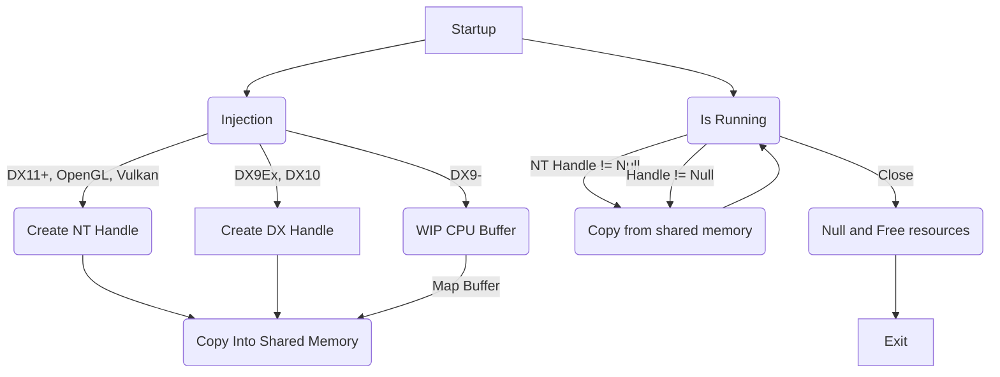

SylvScreenShare is a WIP Rust program to capture video game footage. 

This works by injecting into the program, and hooking the present function.

Currently the following APIs are implemented:
| API |  Status  |Reason|
|-----|----------|------|
|DX12 |✅ Working|N/A
|DX11 |✅ Working|N/A
|DX10 |✅ Working|N/A
|DX9  |❌ Broken |Needs CPU Buffer
|DX9ex|❌ Broken |Unimplemented
|DX8  |N/A       |Unplanned
|VK   |✅ Working|N/A
|OGL  |🚧 WIP    |Needs projection matrix

Support for savings videos is WIP, as there are not currently hardware encoder bindings that support weak linkage

The control flow is as follows, barring broken APIs

